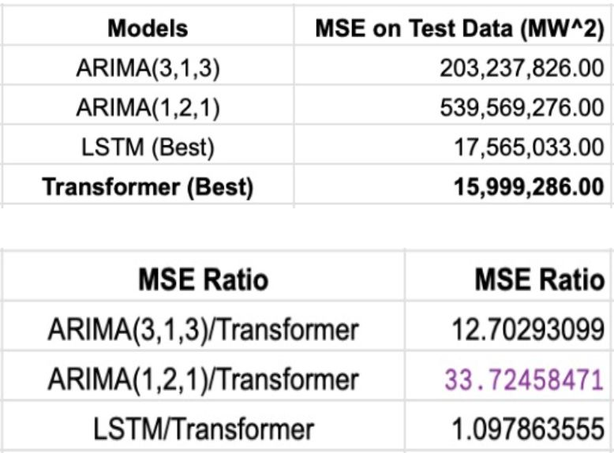

# Forecasting_Comparison-Neural_Networks_vs_ARIMA

This GitHub repository contains the results, code, presentation slides, and report for our Time Series Analysis final course project. We conducted a comparative study of forecasting performances for power consumption in Tetuan City using Sequential Networks LSTMs and a basic Transformer, comparing them against the traditional ARIMA model. 

In this project, we explored the effectiveness of Sequential Networks, particularly the basic Transformer model, in forecasting power consumption time series data for Tetuan City. We aimed to assess how these modern deep learning approaches outperform the classical ARIMA model, especially in terms of Mean Squared Error (MSE) comparison.

We implemented LSTM and basic Transformer models using PyTorch, harnessing the power of deep learning to capture temporal dependencies in the time series data. Additionally, we compared the performance of these models against the widely-used ARIMA model, known for its simplicity and interpretability.

## Results

## Presentation Slides

Here is the link to the [Presentation Slides](https://github.com/sampadk04/Forecasting_Comparison-Neural_Networks_vs_ARIMA/blob/main/slides/TSA_Project_Slides.pdf).

## Final Report

Here is the link to the [Final Report](https://github.com/sampadk04/Forecasting_Comparison-Neural_Networks_vs_ARIMA/blob/main/report/TSA_Project_Report.pdf).